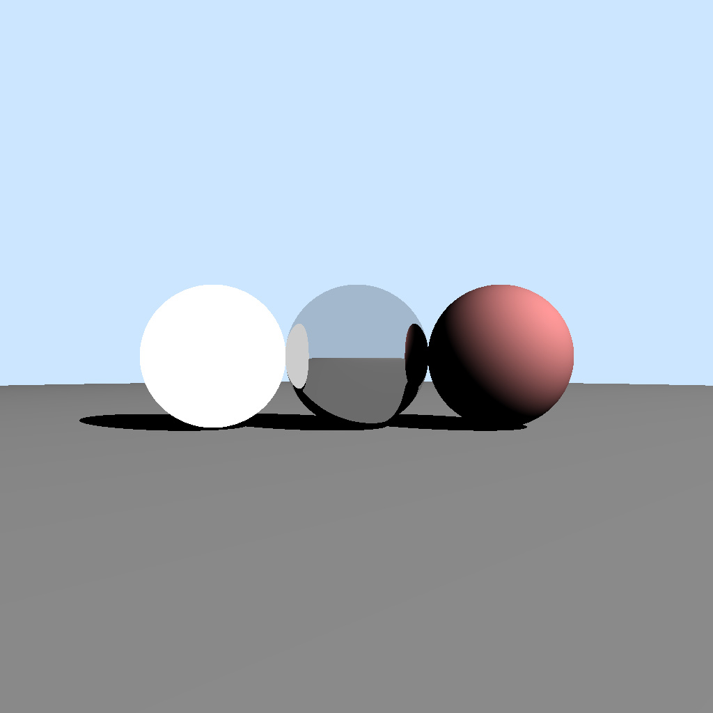
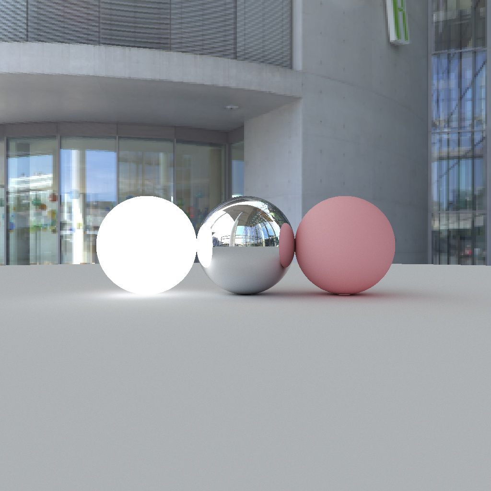
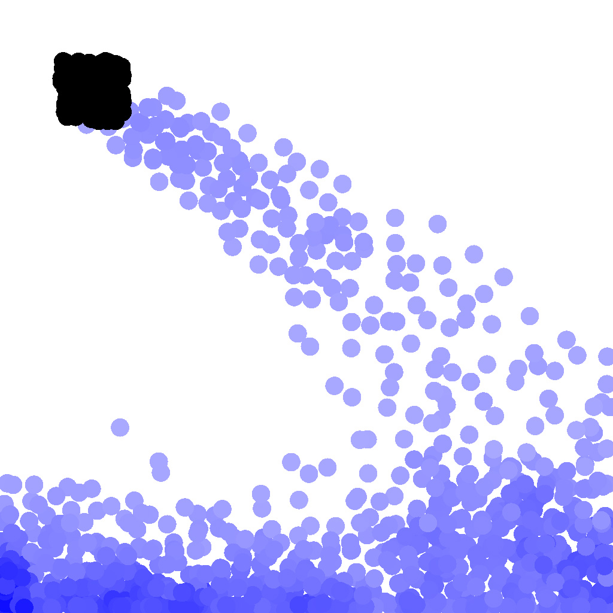
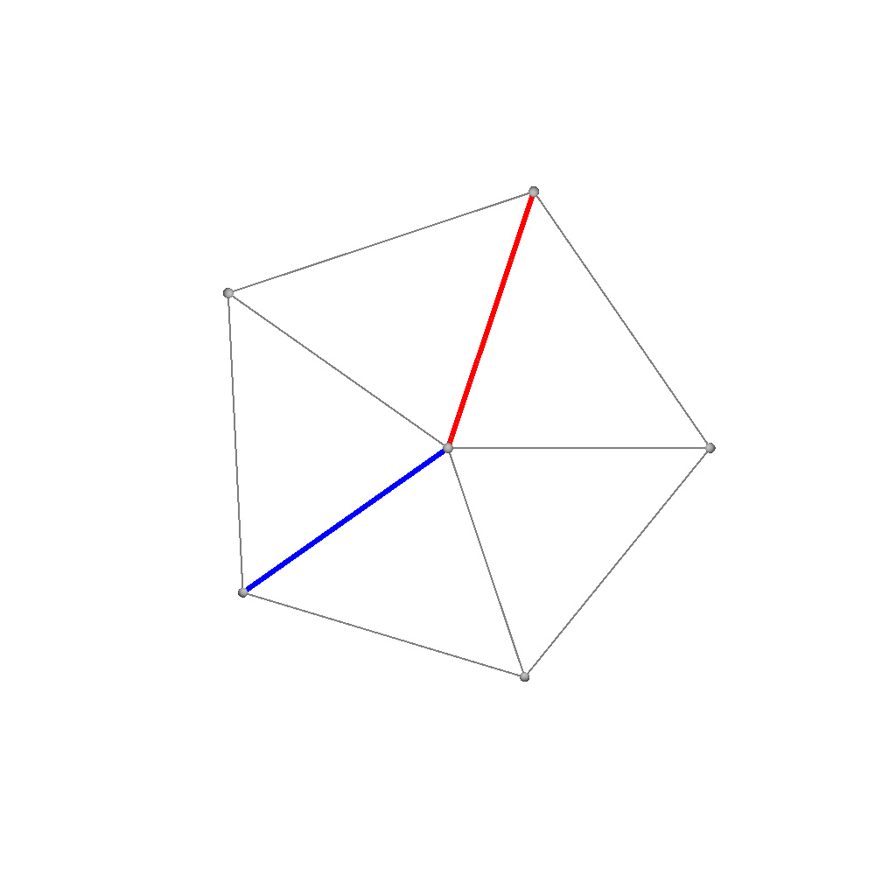
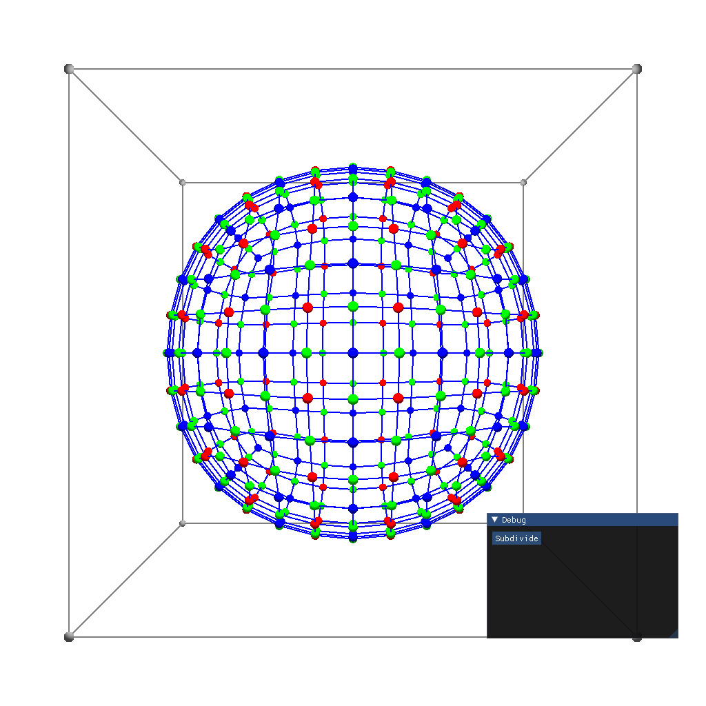
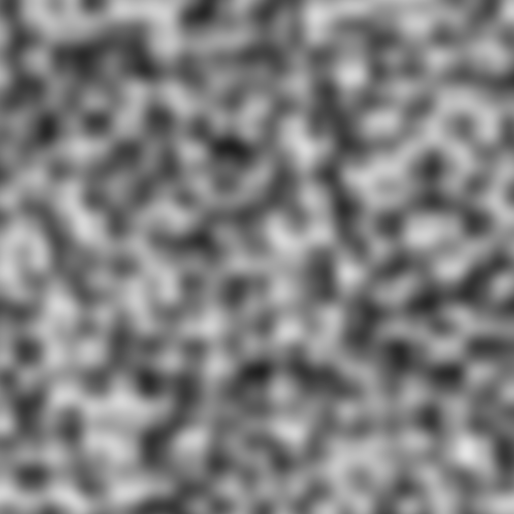

# GP100L

Graphics Programming in 100 Lines

## Contents

- [x] Ray tracing (110 lines)
- [x] Path tracing (100 lines)
- [x] SPH Simulation (99 lines)
- [x] Half-Edge (120 lines)
- [x] Catmull-Clark subdivision (180 lines)
- [x] Perlin noise (100 lines)

<p align="left">






</p>

## Getting started

```sh
git clone https://github.com/yknishidate/GP100L.git

pip install taichi
```

## Library

- [Taichi](https://github.com/taichi-dev/taichi) - Productive & portable high-performance programming in Python.
