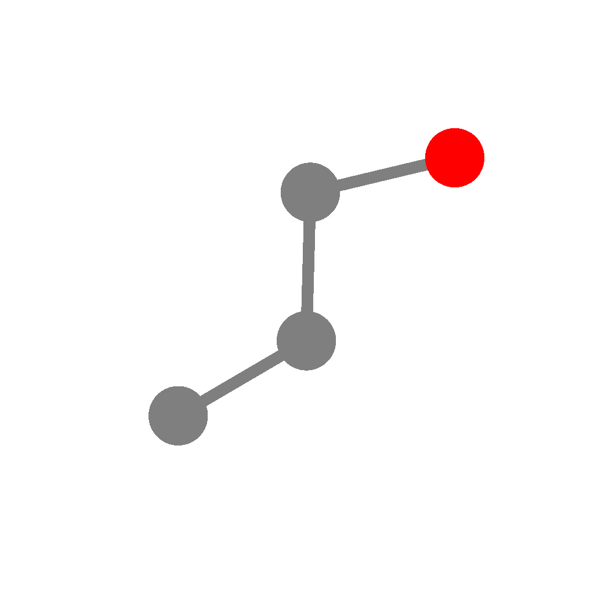

# GP100L

Graphics Programming in 100 Lines

## Contents

- [x] Ray tracing (110 lines)
- [x] Path tracing (100 lines)
- [x] Particle-based fluid (100 lines)
- [x] Grid-based fluid (110 lines)
- [x] Half-edge (120 lines)
- [x] Catmull-Clark subdivision (180 lines)
- [x] Bezier curve (70 lines)
- [x] Perlin noise (100 lines)
- [x] Poisson disk sampling (40 lines)
- [x] Voronoi (50 lines)
- [x] Inverse kinematics (60 lines)
- [x] Sphere-capsule collision (70 lines)
- [x] Convex hull (100 lines)
- [x] Minkowski sum (100 lines)
- [x] Digital differential analyzer (50 lines)
- [x] Bezier DDA (110 lines)
- [x] Jump flood algorithm (90 lines)
- [x] Walk on Spheres (93 lines)

<p align="left">





</p>

## Getting started

I use `rye`.

```cmd
git clone https://github.com/yknishidate/GP100L.git
cd GP100L

rye init
rye pin 3.10
rye add taichi
python src\gp100l\<file_name>
```

## Library

- [Taichi](https://github.com/taichi-dev/taichi) - Productive & portable high-performance programming in Python.
