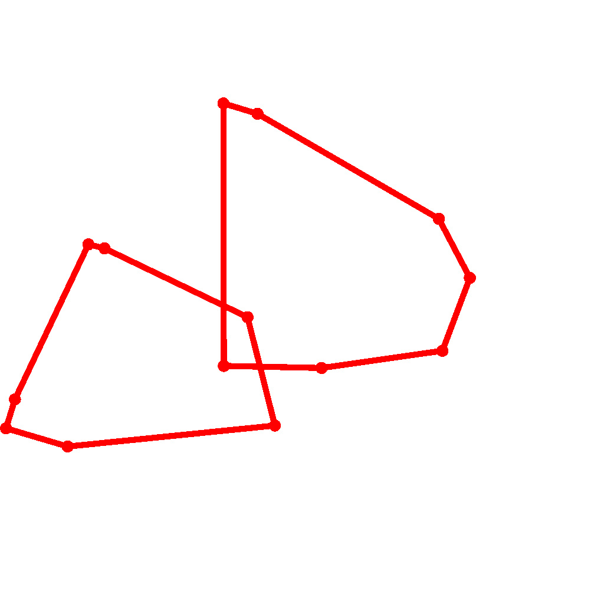

# GP100L

Graphics Programming in 100 Lines

## Contents

- [x] [Ray tracing](./src/gp100l/raytracing.py) (110 lines)
- [x] [Path tracing](./src/gp100l/pathtracing.py) (100 lines)
- [x] [Particle-based fluid](./src/gp100l/particle_fluid.py) (100 lines)
- [x] [Grid-based fluid](./src/gp100l/grid_fluid.py) (110 lines)
- [x] [Half-edge](./src/gp100l/halfedge.py) (120 lines)
- [x] [Catmull-Clark subdivision](./src/gp100l/subdivision.py) (180 lines)
- [x] [Bezier curve](./src/gp100l/bezier.py) (48 lines)
- [x] [Perlin noise](./src/gp100l/perlin_noise.py) (100 lines)
- [x] [Poisson disk sampling](./src/gp100l/poisson_disk.py) (40 lines)
- [x] [Voronoi](./src/gp100l/voronoi.py) (50 lines)
- [x] [Inverse kinematics](./src/gp100l/inverse_kinematics.py) (60 lines)
- [x] [Sphere-capsule collision](./src/gp100l/collision.py) (70 lines)
- [x] [Convex hull](./src/gp100l/convex_hull.py) (100 lines)
- [x] [Minkowski sum](./src/gp100l/minkowski_sum.py) (100 lines)
- [x] [Digital differential analyzer](./src/gp100l/dda.py) (50 lines)
- [x] [Bezier DDA](./src/gp100l/bezier_dda.py) (110 lines)
- [x] [Jump flood algorithm](./src/gp100l/jfa.py) (90 lines)
- [x] [Walk on Spheres](./src/gp100l/walk_on_spheres.py) (93 lines)
- [x] [Rd sequence](./src/gp100l/rd_sequence.py) (42 lines)
- [x] [Tone mapping](./src/gp100l/tonemap.py) (126 lines)

<p align="left">





</p>

## Getting started

I use `rye`.

```cmd
git clone https://github.com/yknishidate/GP100L.git
cd GP100L

rye init
rye pin 3.10
rye add taichi
python src\gp100l\<file_name>
```

## Library

- [Taichi](https://github.com/taichi-dev/taichi) - Productive & portable high-performance programming in Python.
