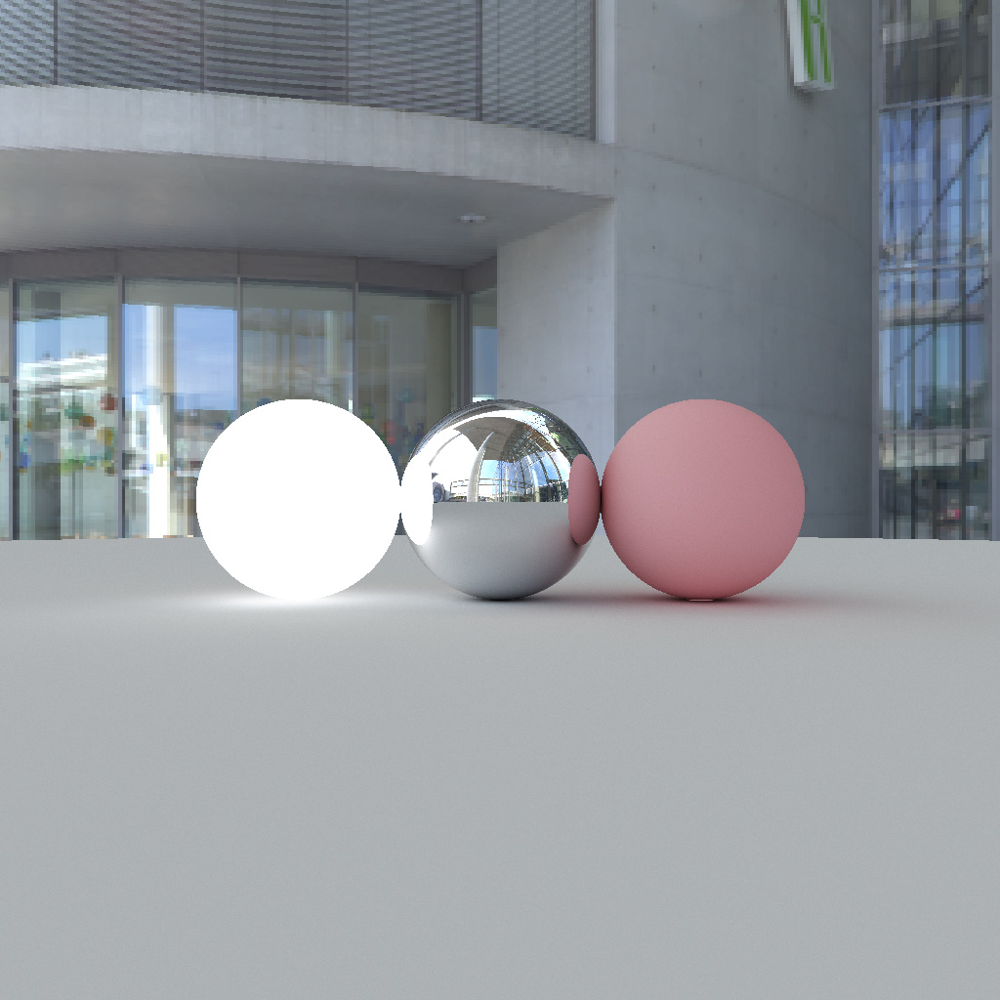

GP100L - Graphics Programming in 100 Lines

# Contents

- [Pathtracing (100 lines)](./pathtracing.html)
- [SPH Simulation (99 lines)](./sph.html)
- [Half-Edge (120 lines)](./halfedge.html)





# Getting started

```sh
git clone https://github.com/yknishidate/GP100L.git

pip install taichi
```

# Library

- [Taichi](https://github.com/taichi-dev/taichi) - Productive & portable high-performance programming in Python.
